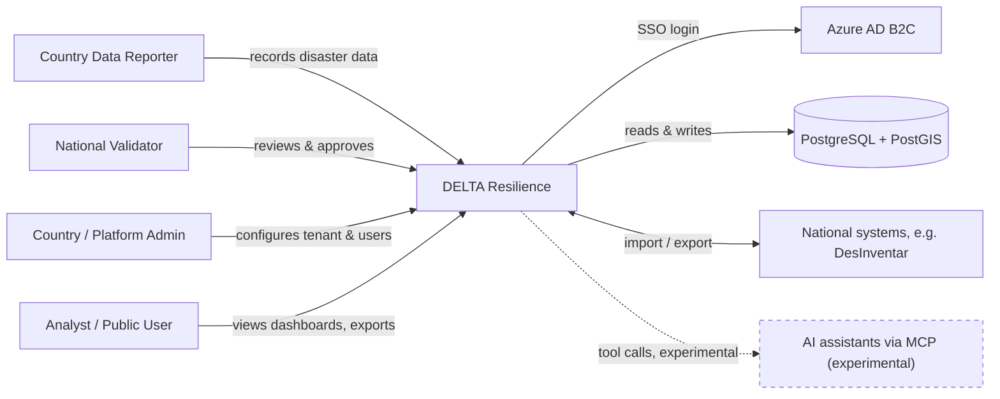
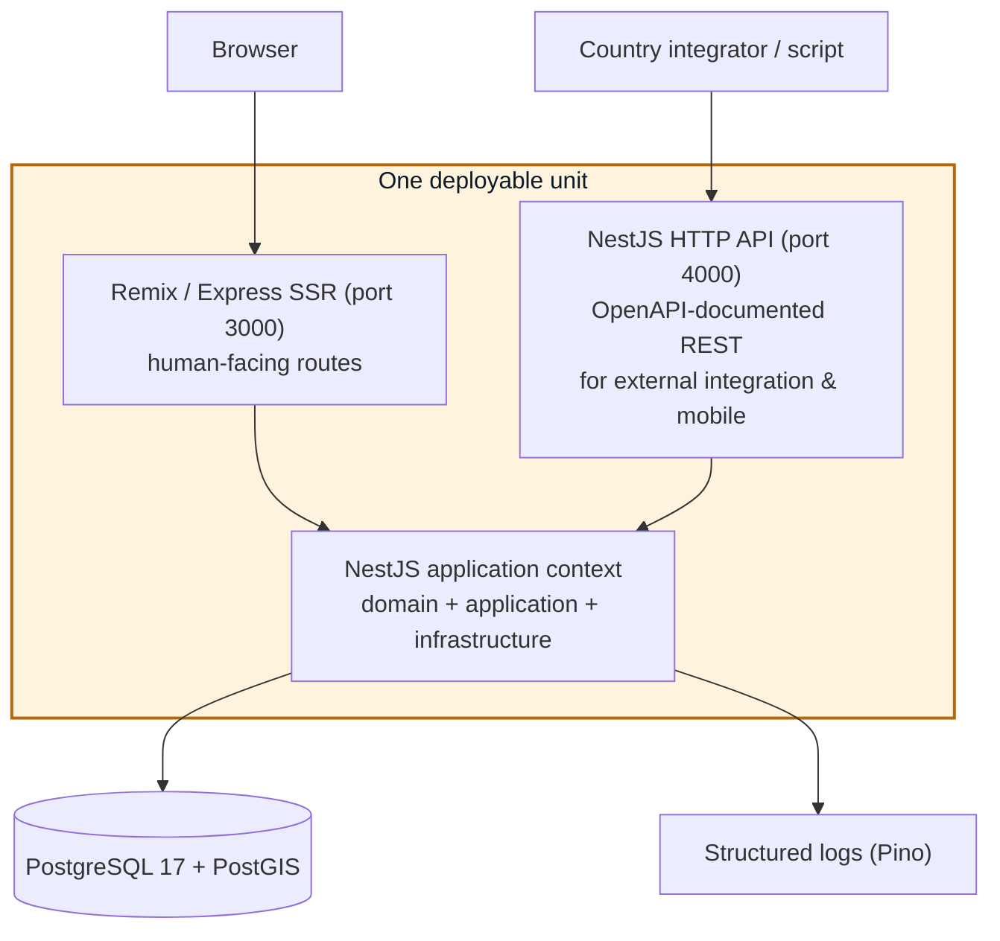
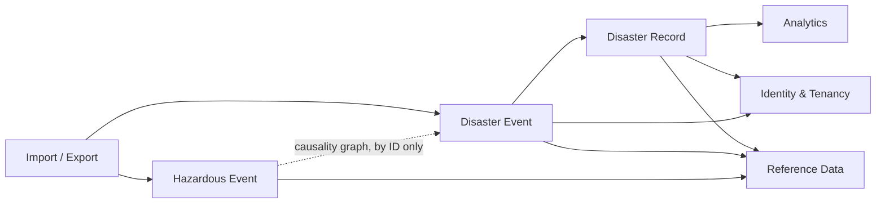

# DELTA Resilience — System Architecture Blueprint

> **Status:** Application is in mid-migration to the architecture described here (Strangler Fig — see [Contributing to Architecture](#contributing-to-architecture)). Everything below is the **target every new contribution must follow**. You will still encounter older code that doesn't yet match it; migrating a piece of it further is welcome.
>
> *Last reviewed: July 2026. Day-to-day migration progress is tracked separately from this document — see the repository's issues and release notes.*

This document is a guided tour of how DELTA is built and how to build on it — not exhaustive API documentation, and not a project roadmap.

## Contents

- [What DELTA is](#what-delta-is)
- [Solution strategy](#solution-strategy)
- [System context](#system-context)
- [Containers](#containers)
- [Codemap: the four layers](#codemap-the-four-layers)
- [Bounded contexts](#bounded-contexts)
- [Cross-cutting rules](#cross-cutting-rules)
- [Contributing to architecture](#contributing-to-architecture)
- [Standards & quality gates](#standards--quality-gates)
- [What to avoid](#what-to-avoid)
- [Where to go deeper](#where-to-go-deeper)
- [Glossary](#glossary)
- [Owning this document](#owning-this-document)

## What DELTA is

DELTA (Disaster & Hazardous Events, Losses and Damages Tracking & Analysis) is UNDRR's open-source, multi-tenant platform for national disaster loss and damage reporting. Mostly, each country runs its own tenant; the same codebase and the same deployment serve all of them. See the project [README](./readme.md) for what it does. This document is about how it's built.

## Solution strategy

Three decisions shape everything else in this document:

- **Clean Architecture + Domain-Driven Design** — code is organized by business concept (a bounded context) and layered so business rules never depend on a specific database or framework. See the [Glossary](#glossary) if these terms are new to you.
- **Strangler Fig migration** — new code is written alongside old code and cut over piece by piece. Nothing is deleted until it's safe. DELTA has years of hard-won, correct domain logic; the goal is to change the structure around it, not replace it.
- **One deployable, not microservices** — the disaster-record domain depends on strong transactional integrity across several entities at once. Splitting into separately-deployed services would break that guarantee for no real benefit at DELTA's scale.

## System context

Who and what DELTA talks to:

## Containers

DELTA runs as **one deployable unit** with two server surfaces sharing a single composition root and one PostgreSQL connection pool:

The Remix/Express app serves every human-facing route via React Router v7's file-based routing; loaders and actions call use cases directly through the shared NestJS application context — no HTTP hop. The NestJS HTTP API runs on port 4000 as a proper, OpenAPI-documented REST surface, not an internal-only convenience layer — it's built so any external system can integrate with DELTA, and so a future mobile app has a stable API to build against. Every endpoint is guarded by a global error filter that turns every thrown domain error into one consistent response envelope (a success flag, machine-readable code, message, trace ID, timestamp) — never a raw stack trace.

## Codemap: the four layers

Every domain follows the same layering. Dependencies point inward only — nothing outside the domain layer, and the domain layer depends on nothing.

| Layer | Lives in | Rule |
|---|---|---|
| **Domain** | `app/domain/<context>/` | Entities, value objects, domain services, repository interfaces ("ports"). Zero framework imports — no NestJS decorators, no Drizzle, no Express types. |
| **Application** | `app/application/<context>/` | One use case per user intent (e.g. `CreateDisasterRecord`). Depends only on domain interfaces — never a concrete database or web framework. Testable with an in-memory fake repository in under 100ms. |
| **Infrastructure** | `app/infrastructure/` | Concrete adapters implementing domain ports: Drizzle repositories, the Pino `ILogger` adapter, NestJS DI wiring. The only layer allowed to import Drizzle, `pg`, or persistence-specific NestJS providers. |
| **Presentation** | `app/routes/` | React Router routes and NestJS HTTP controllers. Parse the request, call a use case, render or return the result. No business logic in a route file. |

If you're asking "where's the thing that does X," start in `domain/` for business rules, `application/` for a specific user action, and `infrastructure/` for how it's actually persisted.

## Bounded contexts

| Context | Responsibility |
|---|---|
| **Hazardous Event** | The physical hazard record — classification, magnitude, HIP taxonomy, spatial footprint, its own approval workflow. |
| **Disaster Event** | The declared disaster — linked to one or more hazardous events by reference, not a shared aggregate. Owns its own approval workflow and is the parent of Disaster Records. |
| **Disaster Record** | Losses, damages, disruption, human impact — the per-record assessment tied to a Disaster Event. |
| **Identity & Tenancy** | Auth, session, roles/permissions, and the `TenantContext` factory. |
| **Analytics** | Typed, read-only query services over the CQRS read model. |
| **Reference Data** | Shared taxonomy and geography (HIP taxonomy, geography, sectors), consumed by every other context. |
| **Import / Export** | CSV and API ingestion — validates input, then delegates to domain services. |

Hazardous Event and Disaster Event are deliberately two contexts, not one. They share a common `event` supertype in the schema, but the real relationship is a causality graph (one hazard can produce multiple disasters, and vice versa for compound events), and each has its own independent approval workflow. Contexts talk to each other only by ID reference — never a shared aggregate, never a direct cross-context import.

## Cross-cutting rules

Every new domain follows these, regardless of which bounded context it's in:

- **Errors** — operational errors (not found, forbidden, invalid input) return a consistent response envelope; programmer errors (bugs) return a generic 500 and log full detail server-side only. See [ADR-003](_docs/decisions/ADR-003-error-handling-architecture.md).
- **Logging** — Pino based logger, zero `console.log`. Structured logs carry tenant ID and trace ID. See [ADR-004](_docs/decisions/ADR-004-logging-and-traceability.md).
- **Multi-tenancy** — a compiler-enforced `TenantContext` threads through every use case and repository call. Database-level Row-Level Security is the backstop for anything the compiler can't catch.
- **Internationalisation** — `react-i18next` + `remix-i18next` for UI strings (SSR-hydrated). Translatable data content stays on the existing Weblate/content-hash system. See [ADR-001](_docs/decisions/ADR-001-multilingual-strategy.md).
- **Timestamps** — always stored in UTC; converted to local time only at the presentation layer. See [ADR-002](_docs/decisions/ADR-002-timezone-handling.md) for the fuller (in-progress) plan around per-event timezones.
- **Currency** — see [ADR-005](_docs/decisions/ADR-005-currency-storage-and-conversion.md) for the target design (immutable storage + a versioned exchange-rate table). This is still being built out — check current state before assuming it's fully wired up.

## Contributing to the architecture

**Adding a feature to an existing bounded context:**

1. Write an [OpenSpec](_docs/workflows/openspec.md) proposal before writing code — what's changing, why, and how.
2. Follow the four-layer pattern above. Use the pilot `notices` domain (`app/domain/notices/`, `app/application/notices/`, `app/infrastructure/`) as the reference implementation — it's the first domain built end-to-end this way.
3. Write the failing test first (TDD), then implement.
4. Open a PR. It needs a green CI run, a CodeRabbit pass, and a maintainer's review before merge.

**Proposing a new bounded context:**

1. Write an ADR describing the new context: its boundary, its ubiquitous language, and what it does *not* own.
2. Get a maintainer's sign-off on the ADR before starting implementation — this is a structural decision, not just a code change.
3. From there, follow the same process as above.

There's no separate formal RFC process beyond this at present — an ADR plus maintainer sign-off is the bar. Adding a process overhead we don't need at this scale is its own kind of technical debt.

## Standards & quality gates

- **Spec-first, test-driven** — every non-trivial change starts as a written proposal before any code is touched, followed by a failing test, then implementation and refactoring unless production ready.
- **PR-gated CI** — type-check, lint, tests, and a coverage ratchet must pass before merge. Two ESLint architectural rules fail the build on a cross-bounded-context import or a presentation-layer file reaching into infrastructure directly.
- **Two independent reviews** — CodeRabbit posts an automated review and summary on every PR; a human maintainer gives final sign-off. No agent / individual should merge its own change.
- **Testing pyramid** — unit tests against fake repositories (no DB), integration tests against PGlite/real Postgres, Playwright end-to-end for user-facing flows, mutation testing on the most security-critical modules (session, auth).

## What to avoid

- **Don't cross a bounded-context boundary directly.** If Disaster Record needs something from Hazardous Event, reference it by ID through its public interface — don't import its internals.
- **Don't call the database from anywhere but infrastructure/.** A route or a use case that imports Drizzle directly is a sign the layering has been skipped.
- **Don't add `console.log`.** Use the injected `ILogger` only for everything that ships.
- **Don't invent a new cross-cutting pattern** for something an ADR already covers (errors, logging, currency, timezone, i18n). Propose a change to the ADR instead of a one-off exception.
- **Don't copy a pattern from the known-bugs list.** A short list of confirmed bugs not to extend or reuse as a template lives in [`.github/copilot-instructions.md`](.github/copilot-instructions.md) — check it before modeling new code on something existing.

## Where to go deeper

- [`_docs/decisions/`](_docs/decisions/) — the Architecture Decision Records referenced above
- [`_docs/code-structure/`](_docs/code-structure/) — models, handlers, routes, Drizzle, and testing conventions in detail
- [`_docs/workflows/openspec.md`](_docs/workflows/openspec.md) — the spec-first workflow
- [`.github/agents/README.md`](.github/agents/README.md) — the AI agents used in this workflow and when each is invoked
- [`CONTRIBUTING.md`](CONTRIBUTING.md) — how to set up your environment and submit a PR
- [`SECURITY.md`](SECURITY.md) — how to report a vulnerability

## Glossary

| Term | Plain-English meaning |
|---|---|
| **Clean / Layered Architecture** | Organising code into layers — business rules, use cases, technical plumbing, user interface — so business logic doesn't depend on any specific database or framework. |
| **Domain-Driven Design (DDD)** | Structuring code and language around real business concepts instead of database tables, so the code matches how the business actually describes its work. |
| **Bounded Context** | A boundary within which a business term has one precise, agreed meaning, so contexts can evolve independently without naming clashes. |
| **Strangler Fig Pattern** | Migrating a system gradually — new code alongside the old, cut over piece by piece — instead of a risky one-time rewrite. |
| **Test-Driven Development (TDD)** | Writing a failing test that describes the desired behaviour before writing the code that makes it pass. |
| **Spec-First / Spec-Driven Development (SDD)** | Writing and reviewing a short design document before any code is written. |
| **CQRS** | Command Query Responsibility Segregation — a separate, simplified copy of the data purpose-built for fast reporting, kept in sync with the main database. |
| **Row-Level Security (RLS)** | A rule enforced by the database itself, not just the application, that one tenant's data can never be read or written by another. |
| **Architecture Decision Record (ADR)** | A short written record of a significant technical decision and the reasoning behind it. |
| **Digital Public Good (DPG)** | A formal designation for open-source software meeting defined standards for privacy, security, and openness. |

## Owning this document

This file is reviewed whenever an ADR changes the shape described here, and at each migration phase gate. It intentionally does not track day-to-day status, progress percentages, or open issues. If you find something in this document that no longer matches the code, open a PR against this file itself; that mismatch is a bug, the same as any other.
